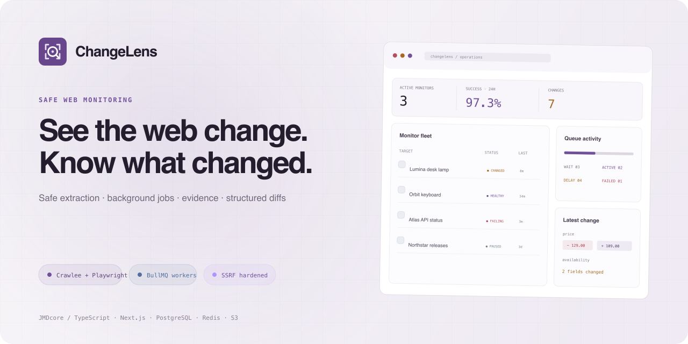
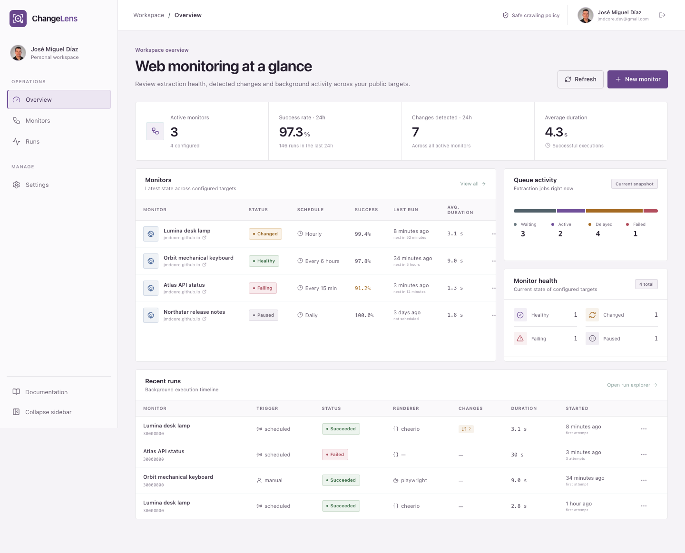
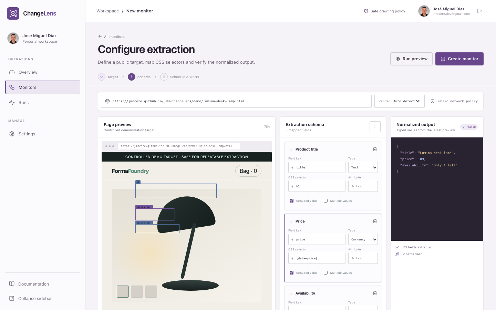
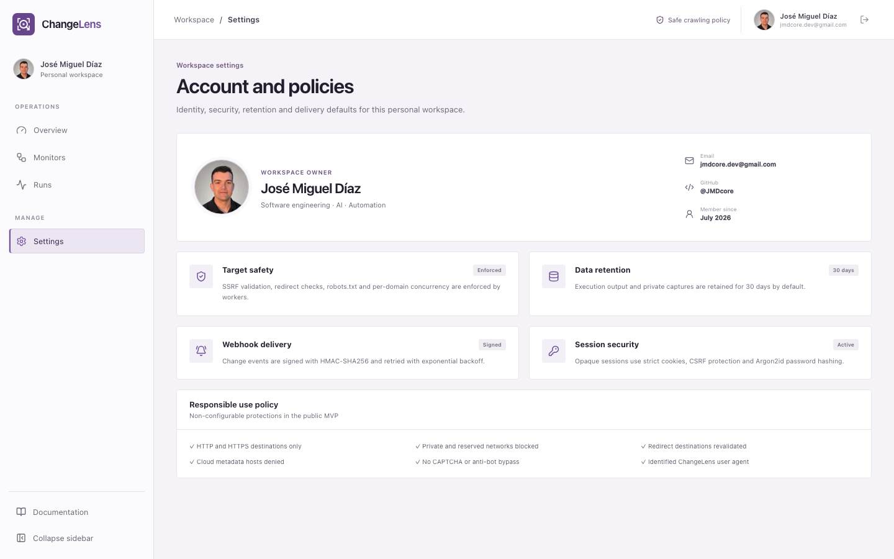
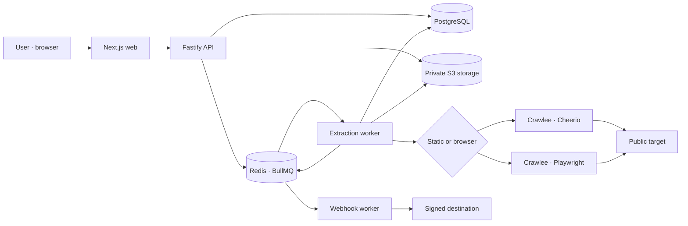

<div align="center">
  

  <p><strong>Visual web data extraction and change monitoring, built as an observable background-processing system.</strong></p>

  <p>
    <a href="https://github.com/JMDcore/JMD-ChangeLens/actions/workflows/ci.yml"></a>
    <a href="https://github.com/JMDcore/JMD-ChangeLens/actions/workflows/codeql.yml"></a>
    
    
    <a href="LICENSE"></a>
  </p>
</div>

ChangeLens turns selected parts of public web pages into structured, versioned data. A monitor can use fast static HTML extraction or a headless browser, run manually or on a schedule, capture evidence, compare normalized values, and deliver a signed webhook when something changes.

This is not a bulk scraping toolkit or an anti-bot bypass. Its product and security boundaries deliberately favor controlled, legitimate monitoring: public targets only, `robots.txt`, explicit identification, per-domain pacing, no CAPTCHA bypass, and application-level SSRF defenses.



<table>
  <tr>
    <td width="50%"></td>
    <td width="50%"></td>
  </tr>
  <tr>
    <td align="center"><sub>Page preview, CSS schema and normalized output</sub></td>
    <td align="center"><sub>Portfolio identity and enforced workspace policies</sub></td>
  </tr>
</table>

## What the MVP demonstrates

| Product capability          | Technical implementation                                                     |
| --------------------------- | ---------------------------------------------------------------------------- |
| Visual operations workspace | Next.js App Router, React, responsive dense UI                               |
| Typed CSS extraction        | Zod contracts, Cheerio, normalized scalar types                              |
| JavaScript-rendered targets | Crawlee with isolated Playwright jobs                                        |
| Manual and recurring runs   | BullMQ jobs and idempotent Job Schedulers                                    |
| Execution history and diffs | PostgreSQL snapshots, canonical hashes, field-level changes                  |
| Evidence and exports        | Private S3-compatible screenshots, JSON and CSV                              |
| Change alerts               | HMAC-SHA256 signed webhooks with bounded redirects and retries               |
| Operational visibility      | Structured logs, health/readiness endpoints, Prometheus metrics              |
| Secure user boundary        | Argon2id, opaque sessions, strict cookies, CSRF, rate limits                 |
| Responsible target policy   | `robots.txt`, identified user agent, domain leases, SSRF validation          |
| Deliberate product design   | Evidence-first operations UI, responsive editor and documented visual system |

The direct in-page element picker, list extraction, pagination, public API keys, email alerts and optional AI assistance are intentionally outside this first release. CSS selectors remain the source of truth; the editor provides a controlled visual mapping experience today.

## Architecture



The monorepo separates request/response work from resource-heavy crawling. The API never launches a browser; workers own target access, retries, per-domain locks, screenshots, retention and alerts. See [the architecture guide](docs/ARCHITECTURE.md) and [security model](docs/SECURITY_MODEL.md).

## Quick start

Requirements: Node.js 24+, pnpm 11+ and Docker with Compose.

```bash
git clone https://github.com/JMDcore/JMD-ChangeLens.git
cd JMD-ChangeLens
cp .env.example .env
pnpm install
pnpm exec playwright install chromium
pnpm services:up
pnpm db:migrate
pnpm db:seed
pnpm dev
```

Open `http://localhost:3000` and sign in with:

```text
demo@changelens.dev
ChangeLensDemo!2026
```

The seed is deterministic and points at controlled pages in `apps/web/public/demo`. This makes product demonstrations and browser tests repeatable without touching third-party sites.

To run the UI without PostgreSQL, Redis or S3, use the portfolio snapshot:

```bash
NEXT_PUBLIC_DEMO_SNAPSHOT=true pnpm dev:web
```

### Full Docker environment

```bash
docker compose --profile app up --build
```

The app profile runs database migrations before the API becomes healthy. Development ports bind to `127.0.0.1`; screenshots stay private in the S3 bucket.

## Verification

```bash
pnpm check       # format, lint, types, unit/integration tests, production build
pnpm test:e2e    # Chromium desktop and mobile product flows
pnpm audit       # production dependency audit; high severity fails
pnpm licenses list --prod # production license inventory
```

The automated suite includes dedicated cases for URL schemes, credentials, ports, localhost, cloud metadata, private/reserved IPv4 and IPv6 ranges, mixed DNS answers, redirect policy, signatures, queue configuration, domain pacing, API headers and CSRF behavior.

## Security boundary

ChangeLens validates the original URL, every redirect, the final URL, browser subrequests and webhook destinations. It rejects credentials, non-HTTP protocols, non-standard ports, private/reserved/link-local networks and known metadata names. Browser work runs outside the API process with bounded time, response size, redirects and concurrency.

Application validation is one layer, not a replacement for production egress controls. A public deployment should place workers behind a network policy or egress proxy that independently denies private and metadata ranges. See [SECURITY.md](SECURITY.md) for reporting and [the threat model](docs/SECURITY_MODEL.md) for residual risks.

## Repository map

```text
apps/
  web/       product UI and controlled demo targets
  api/       authentication, monitors, history, exports and metrics
  worker/    extraction, screenshots, diffs, retention and webhooks
packages/
  contracts/ shared schemas, types and canonical diff logic
  database/  Drizzle schema, migrations and deterministic seed
  queue/     BullMQ jobs, retry policy and recurring schedulers
  scraper/   Crawlee engines, typed extraction and URL policy
  storage/   private S3-compatible screenshot storage
  config/    validated runtime configuration
docs/        architecture, security, decisions and publication assets
```

## Design decisions

- **Monorepo, separate runtimes.** Shared contracts stay consistent while API and worker failure domains remain independent.
- **PostgreSQL as source of truth.** BullMQ coordinates work; durable execution state and change history live in relational storage.
- **Static first, browser when needed.** `auto` mode avoids browser cost when Cheerio already resolves useful values.
- **Field-level normalized diffs.** Original selectors and extracted values are authoritative. AI is not in the decision path.
- **LocalStack instead of a source-only S3 server.** Development exercises the AWS S3 API with private objects served only through an authenticated, ownership-checked API route.
- **Webhook first for alerts.** It proves asynchronous delivery, signatures and retry behavior without coupling the MVP to an email provider.
- **Evidence over decoration.** Dashboard summaries come from API state; unsupported trends, fake worker counts and inactive controls are kept out of the interface.

Architecture decisions and trade-offs are expanded in [ADR-001](docs/decisions/001-monorepo-runtime-boundaries.md), the [product scope](docs/PRODUCT.md) and the [product design system](docs/DESIGN_SYSTEM.md).

## Open-source references

ChangeLens studied product and architecture patterns from Crawlee, changedetection.io, Scrapy, Firecrawl and Crawl4AI. No application source code was copied. Their current licenses and the boundary between inspiration and implementation are recorded in [REFERENCES.md](docs/REFERENCES.md). The upstream Playwright seccomp configuration is identified separately in [THIRD_PARTY_NOTICES.md](THIRD_PARTY_NOTICES.md).

## Contributing and responsible use

Read [CONTRIBUTING.md](CONTRIBUTING.md) and the [Code of Conduct](CODE_OF_CONDUCT.md). By using ChangeLens you are responsible for the target's terms, applicable law and data-protection obligations. Do not use it to bypass access controls, collect personal data at scale, or create harmful load.

Built by [José Miguel Díaz](https://github.com/JMDcore) · MIT licensed.
