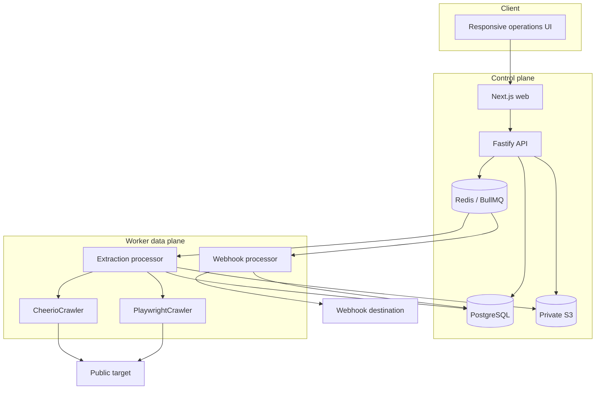
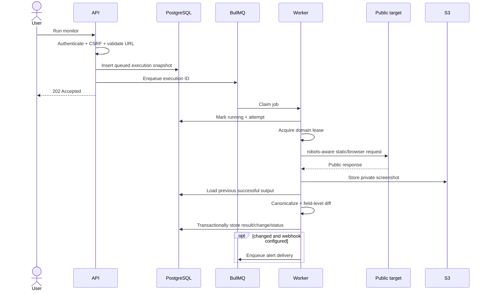

# Architecture

## System context

ChangeLens is a TypeScript monorepo with three deployable applications and six shared packages. The separation exists because HTTP request handling and untrusted browser automation have different performance, scaling and security characteristics.

## Runtime responsibilities

### Web

- Renders the authenticated product UI and responsive navigation.
- Calls the API through a same-origin rewrite.
- Includes a snapshot mode for deterministic visual review without infrastructure.
- Serves controlled demo targets used by the seed and E2E suite.
- Does not contain database credentials or execute crawl jobs.

### API

- Owns authentication, authorization and CSRF enforcement.
- Validates requests with shared Zod contracts.
- Manages monitor and extraction-field CRUD.
- Creates durable execution records before queue publication.
- Reconciles recurring BullMQ Job Schedulers with monitor state.
- Returns private screenshot links and exports only after ownership checks.
- Exposes liveness, dependency readiness and protected Prometheus metrics.

### Worker

- Claims extraction and webhook jobs from separate queues.
- Acquires a Redis lease per hostname and enforces a minimum start delay.
- Applies URL/robots/size/time/redirect policy and selects a renderer.
- Stores normalized output, evidence, structured logs and field-level changes.
- Deletes expired executions and screenshots according to monitor retention.
- Creates and retries signed webhook deliveries.

## Execution sequence

## Data model

| Entity              | Purpose                                          | Important boundaries                                        |
| ------------------- | ------------------------------------------------ | ----------------------------------------------------------- |
| `users`             | Account identity and Argon2id hash               | Email unique; password never logged                         |
| `sessions`          | Opaque server-side sessions                      | Token stored only as SHA-256; expiry and last seen          |
| `monitors`          | Target, schedule, retention and alert settings   | Always scoped to `user_id`                                  |
| `extraction_fields` | Ordered selector schema                          | Key unique within a monitor                                 |
| `executions`        | Immutable input snapshot plus mutable job result | Ownership retained even for previews                        |
| `changes`           | Baseline relationship and structured diff        | One row per completed monitored execution                   |
| `alert_deliveries`  | Webhook attempt state                            | Destination hostname stored, secret is global configuration |
| `audit_logs`        | Security-relevant control-plane events           | Request ID and entity reference                             |

Execution records keep the input schema snapshot so a retry or historical inspection does not silently use later monitor edits.

## Reliability invariants

- The database record exists before a manual or preview job is published.
- Scheduled jobs create at most one execution ID and persist it into BullMQ job data before processing.
- A succeeded execution is idempotent and will not run again after a worker restart.
- Baselines use the previous successful execution, never a failed or blocked attempt.
- Monitor status and its change row are updated in the same database transaction.
- Alert delivery is a separate queue so slow destinations do not occupy browser capacity.
- Blocked policy decisions use unrecoverable job errors; transient navigation errors use bounded exponential retry.

## Scaling model

API and web instances are stateless. Workers scale horizontally, while the Redis hostname lease prevents concurrent starts against the same domain across worker instances. Browser concurrency is separately bounded by environment configuration and container resources.

PostgreSQL remains the durable source of truth. Redis can be recovered without losing completed history; recurring schedules are reconciled when monitors are created or updated. S3 keys are unguessable and captures are streamed only after the API verifies session ownership.

## Deployment notes

The Compose app profile is a local reference topology, not a production network boundary. A production deployment should add:

- TLS at an ingress proxy and secure cookies.
- Managed PostgreSQL, Redis and private object storage.
- Separate API and worker identities with least-privilege credentials.
- An egress firewall or proxy that denies private, reserved and metadata ranges.
- A browser-compatible seccomp profile and resource limits.
- Centralized logs, Prometheus scraping and alerts on failure/queue-depth signals.
- Secret rotation and independent webhook signing keys per environment.
