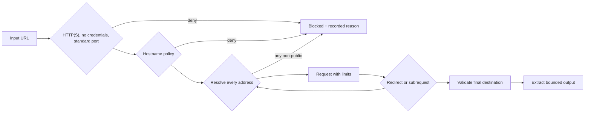

# Security model

## Assets and trust boundaries

ChangeLens protects account credentials, opaque sessions, monitor configuration, extracted outputs, screenshots, webhook secrets and infrastructure credentials. Public target content is untrusted even when the user supplied the URL.

The primary trust boundaries are browser → API, API → data services, queue → worker, worker → target, worker → object storage and worker → webhook destination.

## Threats and controls

| Threat                     | Current controls                                                                                                                                                                                   | Residual risk / production control                                                     |
| -------------------------- | -------------------------------------------------------------------------------------------------------------------------------------------------------------------------------------------------- | -------------------------------------------------------------------------------------- |
| SSRF through target URL    | HTTP(S) only; credentials and non-standard ports denied; known local names denied; all DNS answers checked; private, reserved, loopback, link-local, CGNAT, mapped IPv6 and metadata ranges denied | DNS is time-dependent; enforce the same deny policy at the network/egress layer        |
| SSRF through redirects     | Static redirect hook, final URL validation, browser request routing                                                                                                                                | Egress firewall remains the independent backstop                                       |
| Browser subresource access | Every non-data/blob/about request is validated and blocked client-side                                                                                                                             | Treat Chromium and target content as untrusted; isolate workers from internal networks |
| Webhook SSRF               | Same public URL policy, manual redirects, three-redirect maximum, ten-second timeout                                                                                                               | Destination can change DNS after validation; apply egress controls                     |
| Credential theft           | Argon2id password hashes, opaque random sessions, token hashes at rest, strict HttpOnly cookies                                                                                                    | TLS and `COOKIE_SECURE=true` are mandatory outside local development                   |
| Cross-site request forgery | SameSite strict session cookie plus double-submit CSRF token for mutations                                                                                                                         | XSS would bypass this; keep CSP and dependency hygiene in production                   |
| Account enumeration        | Generic login error and dummy Argon2 verification                                                                                                                                                  | Registration still reports an existing address by design                               |
| Resource exhaustion        | 1 MiB API body, request rate limits, URL/field caps, response/time/redirect limits, worker concurrency, per-domain leases                                                                          | Add CPU/memory quotas, queue depth alerts and tenant quotas                            |
| Unsafe scraping behavior   | `robots.txt`, explicit user agent, no sessions/proxies/blocked retries, no CAPTCHA or anti-bot bypass                                                                                              | Site terms and applicable law remain the operator's responsibility                     |
| Screenshot disclosure      | Private bucket, UUID keys and an authenticated, ownership-checked streaming route                                                                                                                  | Configure bucket public-access blocks and storage audit logs                           |
| Alert forgery/replay       | HMAC-SHA256 body signature, delivery/event IDs and timestamp                                                                                                                                       | Consumers should retain delivery IDs and reject stale/replayed events                  |
| Sensitive logs             | Pino redaction of authorization, cookies, passwords, URLs and webhook fields; structured context                                                                                                   | Operators must not add raw page bodies or secrets to logs                              |
| Supply-chain compromise    | Frozen lockfile, pnpm build allowlist, minimum release age policy, Dependabot, audit and CodeQL                                                                                                    | Pin action SHAs for a higher-assurance deployment and review all updates               |

## URL validation pipeline

The browser route guard allows only `data:`, `blob:` and `about:` resources without network validation. All HTTP(S) navigation and asset hosts pass the public-network policy. A blocked decision aborts the request and becomes an execution error rather than triggering anti-bot retries.

## Security tests

The unit suite covers unsafe schemes, URL credentials, non-standard ports, localhost and `.internal` names, Google metadata, private/reserved/link-local/CGNAT IPv4, loopback/unique-local/mapped IPv6, mixed public/private DNS responses and valid public answers. Integration tests verify security headers, CSRF error shape, request IDs and metrics authorization. Webhook signatures and redirect validation are isolated from extraction retries.

## Data lifecycle

- Monitor retention is 1–365 days; 30 is the default.
- Expired execution rows cascade their changes and alert deliveries.
- Associated screenshot objects are deleted after the database selection.
- Deleting a monitor removes each associated private screenshot before the database transaction cascades fields and executions. S3 deletion is idempotent, so a failed request can be retried safely.
- The MVP does not collect authenticated pages by design.

## Hardening checklist for public deployment

1. Generate unique database, Redis, metrics and webhook secrets.
2. Enable TLS, secure cookies and a restrictive Content Security Policy.
3. Remove direct public access to PostgreSQL, Redis, S3 and worker health ports.
4. Place worker egress behind a policy that rejects all non-public networks, regardless of DNS.
5. Keep the worker's reviewed Playwright seccomp profile current and add hard memory/CPU limits for the target host.
6. Configure object-storage public-access blocks, encryption and lifecycle reconciliation.
7. Alert on blocked-rate spikes, repeated domain failures, queue latency and worker restarts.
8. Review target data categories and retention under applicable privacy rules.

## Out of scope

ChangeLens does not claim to defend against a malicious infrastructure administrator, a compromised host/kernel, browser zero-days or misuse by an operator with direct database access. It is not designed to access internal services, authenticated targets or personal-data datasets.
